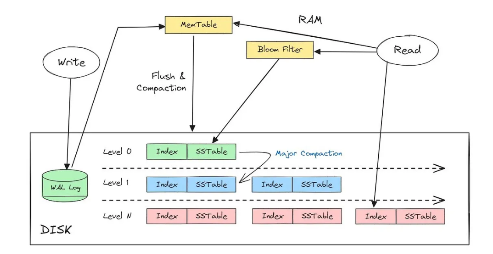

**Categories of Storage Engines:**

**OLTP (Online Transaction Processing):**

- Designed for a huge volume of requests.

- Queries typically target a small number of records in each request.

- Examples: MySQL, Postgres, MongoDB.

**OLAP (Online Analytical Processing):**

- Designed for analytic systems and complex queries over large datasets.

- Examples: Amazon Redshift, Snowflake.

**OLTP Storage Architectures**

**Log-Structured Storage**

All writes (inserts and updates) are treated as sequential appends to a log file. Old data is never modified; newer versions are simply added to the end.

Indexing examples: LSM-Tree Architecture, Hash Indexes

**Page-Oriented Storage**

Data is organized into fixed-size pages (or blocks). Updates involve reading, modifying, and writing the page back to the same location (overwriting in place).

Indexing examples: B-Tree Indexes

**Trade-off of Storage Systems**: Well-chosen indexes speed up read queries, but every index slows down write queries.

**Index**

An index is an additional structure derived from the primary data.

1. **Hash Indexes**

- Uses a hash function to map a column's value directly to the physical location.

- Very useful for looking for exact matches with a lookup complexity of $O(1)$ (constant time).Useless for ranges and sorting (ORDER BY).

- Needs to be explicitly indicated that we want them.

- Example: `CREATE INDEX idx_email_hash ON Users (Email) USING HASH`

 2. **B-Tree Indexes**:
 
- A tree structure that keeps all keys sorted.

- The regular/default index used by most systems.

- Less fast for exact matches ($O(\log n)$) than Hash indexes.

- Excellent for handling ranges since keys are sorted.

- Example: `CREATE INDEX idx_email_hash ON Users (Email)`

**LSM-Tree Architecture**

- The Log-Structured Merge-Tree (LSM-Tree) is a storage strategy designed to make database writes incredibly fast, especially on modern SSDs.

- Used by systems like Apache Cassandra and Google BigTable.

**Sorted String Table (SSTable)**

- An immutable (read-only) persistent file format.

- Used by LSM-Trees to store data on disk.

- Optimized for write-heavy workloads.

**Solves the problem of Random vs. Sequential Writes**

- **Random Write**: When updating a record, the system must jump all over the disk to find the exact spot and overwrite the data (Slow).

- **Sequential Write**: Writing data in a continuous stream (Fast).

**Write Optimization Process**

1. Incoming Write: New/updated data goes to two places simultaneously:

  a) Write-Ahead Log (WAL): A sequential log file on disk for durability (to recover recent changes if the system crashes).

  b) Memtable: Data is stored in a sorted structure in RAM (e.g., a SkipList or Red-Black Tree).

2. Flush to Disk: When a Memtable is full, it is quickly flushed to disk as a new, immutable SSTable file. Since the data was already sorted in memory, it is written sequentially on disk.

3. Updates, Deletes, and Compaction:

a) Updates/Deletes: The old SSTable is never modified; a new version (or a tombstone for a delete) is written as a new entry to the active Memtable.

b) Reads: To find a record, the system checks the Memtable first (fastest) and then checks the SSTables from newest to oldest until it finds the latest version.

c) Compaction: A background process that periodically merges multiple small, inefficient SSTables into one clean, larger new SSTable, discarding old, redundant, and deleted data.

**SSTable File Structure**

An SSTable usually consists of two parts on disk:

a) Data File: All the sorted key-value pairs (efficient for range scans).

b) Index File: A file that maps keys to their physical location within the Data File.

**Advantages of SSTable**

a) Fast Writes: Writes are sequential on disk, maximizing performance.

b) Efficient Reads: The index allows the system to find most data with only one disk lookup (after checking the Memtable).

c) Simplified Concurrency: Since SSTables are immutable, many processes can read them simultaneously without complex locking.

**Issues**

If the database crashes, the most recent writes are lost if they haven't been written to the WAL or flushed from the Memtable. (The WAL is usually designed to prevent loss, but the Memtable is volatile).

**Optimization (Bloom Filters)**

LSM-Trees can be slow when looking for keys that do not exist in the database. Bloom Filters are a space-efficient probabilistic data structure used to quickly check if a key is definitely NOT present in an SSTable file, avoiding unnecessary disk I/O.

**Compaction Strategies**

- **Size-tiered**: Newer and smaller SSTables are merged into older and larger SSTables.

- **Level Compaction**: The key range is split into smaller SSTables, and older data is moved into separate levels, allowing compaction to proceed more incrementally.

